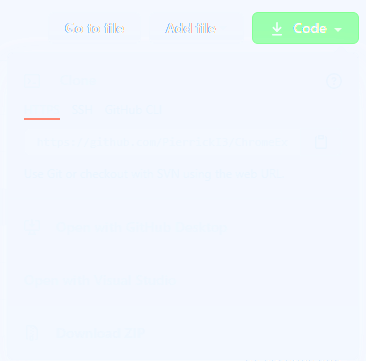

# Genesys Cloud Private Embeddable Framework Chrome Extension with Auto Answer

This chrome extension loads the Genesys Cloud Embeddable Framework, similarly to the Genesys Cloud for Chrome extension but also auto-answers any incoming conversation.

## Deployment

- Clone this repository (`git clone https://github.com/PierrickI3/ChromeExtensionPEFAutoAnswer`) or click on `Code/Download Zip` to download a zip file containing all required files

- If you have downloaded the zip file, make sure you uncompress all files to a specific directory on your machine.
- Open Google Chrome, go to the Settings and open `More Tools/Extensions` item:

- Enable `Developer Mode` (top-right):

- Click on `Load unpacked` (top-left) and select the folder where you have downloaded the files in the first step above
- A new Chrome Extension called `Genesys Cloud for Chrome (AA)` will be added to Chrome
- Click on the icon to load the Genesys Cloud Private Embeddable Framework frame in a separate window:

- Send a call to your user. When received, it should be automatically answered.

## Configuration

This Chrome extension has an `Options` panel that you can use to override defaults. To open the options, right-click on the extension icon and select `Options`:

If you want to change the default region (instead of `mypurecloud.ie`), open the `app/js/settingsHelper.js` file and change the url. You should also make sure your `framework.js` file contains an OAuth Client Id for this region.
